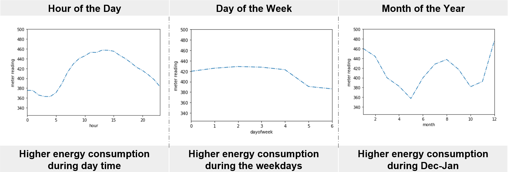
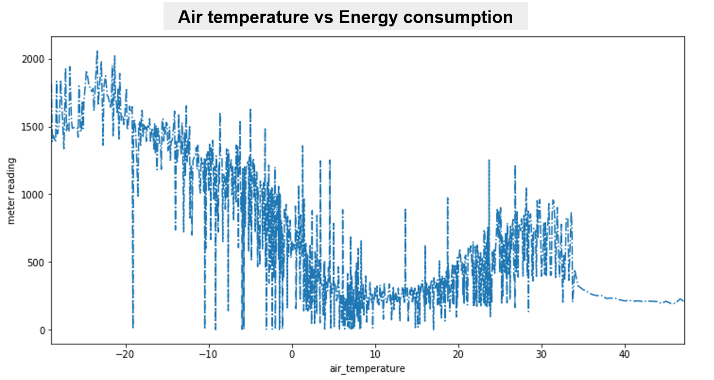
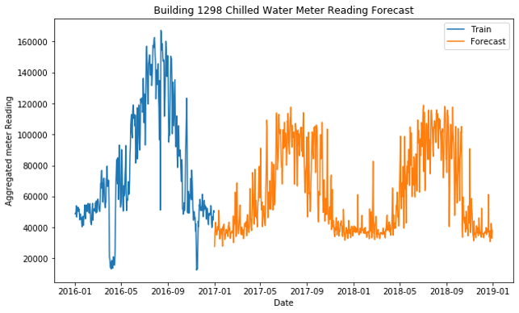

# Forecast of metered energy consumption

# Introduction
Today, significant investments are being made to improve building efficiencies, but owners make payments based on the difference between their real energy consumption and what they would have used without any retrofits. So, we have chosen a Kaggle case competition focusing on building accurate models of metered building energy usage provided by ASHRAE, an institute that serves to advance the arts and sciences of heating, ventilation, air conditioning, refrigeration and their allied fields.

# Data Overview
The data was collected over 3 years across 16 sites for around 1500 buildings. It has: 
#### ● Building metadata
Floor count, area, age, primary use, site, etc.
#### ●	Weather data
Site level hourly data of temperature, wind speed, precipitation, cloud coverage
#### ●	Meter Readings
Building level hourly data of energy consumption readings collected from 4 different meters 
20 million training data points and 40 million test data points

# Approach
•	Data size reduction – Converting int64 and float64 datatypes to int32 and float32 reduced the memory consumption of 60 million data points from 8GB to 4GB 
•	Removed columns with >70% nulls 
•	Label Encoding categorical features to int8 
•	Identified hourly/weekly/monthly patterns in energy consumption 
•	Owing to abundance of data points and categorical variables, we ran LightGBM and CatBoost to predict the energy consumption 

# Patterns in energy consumption

# Sample forecast
Below is a sample forecast obtained from the results of ensembling LightGBM and CatBoost

